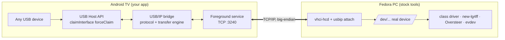
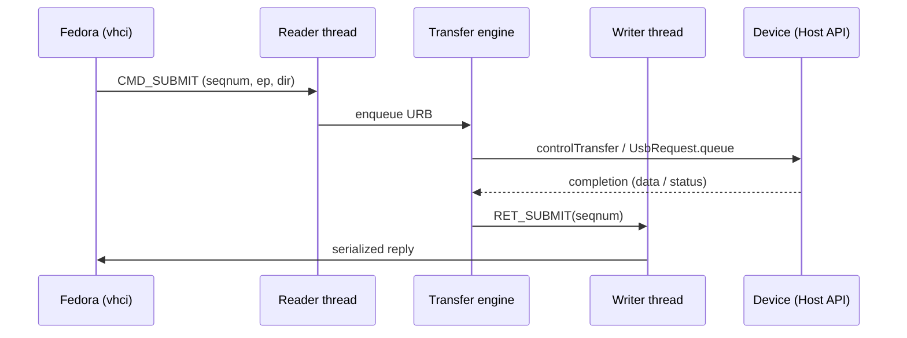
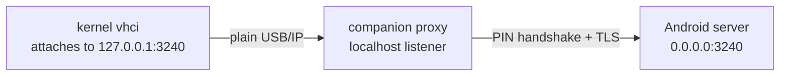

# I/O Tower — Architecture

I/O Tower is a minimal, no-root USB/IP **server** that runs on an Android TV and exposes a
USB device plugged into it to a remote Linux PC as if it were connected locally.

The server is **device-agnostic**: it is a transparent USB pass-through and
never interprets what it's forwarding. All device semantics — a wheel's mode
switch and force feedback, a pad's rumble, LEDs, calibration, anything — are
handled by the ordinary drivers on the PC (`new-lg4ff`, Oversteer, `evdev`,
etc.). The server just moves USB transfers back and forth.

The point: reproduce the useful core of VirtualHere's no-root Android server,
for a single device, using only public APIs — and lean on the Linux kernel for
the entire client side so you write code on one end only.

A Logitech G29 is the concrete device used as the running example and the
validation target throughout, but nothing in the design is specific to it.

---

## 1. Goal and constraints

**Goal.** Plug any (non-isochronous) USB device into the Android TV. On the
Fedora PC, run `usbip attach`, and the device appears as a real local USB device
— so the PC's own drivers bind to it and do everything device-specific. For the
G29 that means `new-lg4ff`/Oversteer configure it and force feedback works;
for a gamepad it means `evdev` sees it; the server treats all of these
identically. Moonlight continues to carry only video/audio.

**Hard constraints that shape the design:**

- **No root on the TV.** Everything on the Android side goes through the
  `android.hardware.usb.host` API (`UsbManager`, `UsbDeviceConnection`,
  `UsbRequest`). This is what makes the project worth doing — and what rules
  out raw `usbfs`/`ioctl` access.
- **No *protocol* code on Fedora.** The kernel already ships the USB/IP client
  (`vhci-hcd`) and the `usbip` userspace tool, so you never implement USB/IP on
  the PC. An optional companion daemon (§9) may orchestrate that stock tool, but
  the core needs nothing beyond it.
- **Speak stock USB/IP.** If you frame the protocol correctly, the unmodified
  in-kernel client talks to your app. You are not inventing a wire format.
- **Transparency over cleverness.** The server forwards raw transfers and raw
  descriptors. It contains no device tables, no VID/PID logic, no per-device
  branches. If a behavior can be pushed to the PC-side driver, it is.

---

## 2. Why this works without root

Android's kernel binds `usbhid` (or another class driver) to a device the moment
it enumerates — that is why the G29 was scrolling the TV UI. The escape hatch is
one flag:

```java
UsbDeviceConnection connection = usbManager.openDevice(device);
connection.claimInterface(intf, /* forceClaim = */ true);   // for every interface
```

`forceClaim = true` tells Android to **detach the kernel driver** from that
interface and hand exclusive control to your app — no root required. Do it for
every interface the device exposes. The scrolling stops the instant you claim,
because the kernel input driver has let go. From there you own the endpoints via
`controlTransfer()` and `UsbRequest.queue()` / `requestWait()`.

The often-repeated "Android blocks HID devices" is narrower than it sounds: bare
boot-protocol mice/keyboards get filtered out of `UsbManager`, and a few devices
never enumerate for userspace. Most devices — including the G29, which you
already proved appears via VirtualHere — are grabbable. **Isochronous** transfers
are the one real capability the Host API lacks, so isochronous devices (webcams,
USB audio) are the class this server cannot carry (see §7).

---

## 3. System architecture



Two processes, one you write:

| Side | What runs | You build? |
|---|---|---|
| **Fedora PC** | `modprobe vhci-hcd`; `usbip attach -r <tv-ip> -b <busid>` | No — stock tools |
| **Android TV** | Your app: USB Host API ⇆ USB/IP server on TCP 3240 | Yes |

The dumb-pipe principle draws a clean line: the app knows *endpoints and
transfers*; the PC knows *devices and drivers*. Neither crosses into the other.

An **optional** third piece — a PC-side companion daemon (§9) — can automate the
attach step, recover from device resets, and add a PIN/TLS gate. It is
orchestration around the stock `usbip` tool, not part of the core, and the
system works without it.

---

## 4. The USB/IP protocol — what to implement

All fields are **network byte order (big-endian)**. The authoritative reference
is `Documentation/usb/usbip_protocol.rst` in the Linux kernel tree; treat the
layouts below as a map, not gospel, and verify against that file.

The protocol has two phases on the same TCP connection.

### 4.1 Negotiation phase

A tiny common header prefixes each request/reply:

```
u16 version   // 0x0111
u16 code      // OP_REQ_* / OP_REP_*
u32 status    // 0 = OK
```

You must handle two exchanges:

- **`OP_REQ_DEVLIST` (0x8005) → `OP_REP_DEVLIST` (0x0005).** Client asks what you
  export. Reply with a device count and, per device, a `usbip_usb_device`
  struct followed by one `usbip_usb_interface` per interface. `usbip list -r
  <ip>` uses this. This is also how a generic server offers a *choice* of
  devices without any hardcoding — advertise every device you've claimed and let
  the client pick a busid.
- **`OP_REQ_IMPORT` (0x8003) → `OP_REP_IMPORT` (0x0003).** Client names a busid
  (32-byte string, e.g. `"1-1"`) to claim. Reply status + the
  `usbip_usb_device`. On success the socket **switches into the transfer phase**
  — no more op headers, only URB traffic.

`usbip_usb_device` (the exported-device struct):

```
char path[256]          // any stable string, e.g. "/sys/devices/tv/1-1"
char busid[32]          // e.g. "1-1"
u32  busnum, devnum
u32  speed              // USB_SPEED_HIGH etc.
u16  idVendor, idProduct, bcdDevice
u8   bDeviceClass, bDeviceSubClass, bDeviceProtocol
u8   bConfigurationValue, bNumConfigurations, bNumInterfaces
```

Fill these straight from `UsbDevice` fields and the parsed descriptors
(`connection.getRawDescriptors()`) — you report whatever the device actually is.
You invent `busid`/`busnum`/`devnum` yourself and reuse them consistently.

### 4.2 Transfer phase

Every message starts with a 48-byte header: a 20-byte basic header plus a
28-byte command-specific block.

`usbip_header_basic` (20 bytes):

```
u32 command     // 1 CMD_SUBMIT · 2 CMD_UNLINK · 3 RET_SUBMIT · 4 RET_UNLINK
u32 seqnum      // per-URB id; echo it back in the matching reply
u32 devid       // (busnum << 16) | devnum
u32 direction   // 0 = OUT, 1 = IN
u32 ep          // endpoint number
```

`USBIP_CMD_SUBMIT` block (28 bytes), then optional payload:

```
u32 transfer_flags
u32 transfer_buffer_length
u32 start_frame           // ISO only
u32 number_of_packets     // 0xFFFFFFFF when not ISO
u32 interval
u8  setup[8]              // control transfers only
// + transfer_buffer[transfer_buffer_length]  when direction == OUT
```

`USBIP_RET_SUBMIT` block (28 bytes), then optional payload:

```
u32 status                // 0 ok, else -errno
u32 actual_length
u32 start_frame
u32 number_of_packets
u32 error_count
u8  padding[8]
// + transfer_buffer[actual_length]  when direction == IN
```

`CMD_UNLINK` carries the `seqnum` of the SUBMIT to cancel; `RET_UNLINK` carries
a status. Everything else in those blocks is padding.

That is the whole surface for a single non-ISO device: **devlist, import,
submit/ret, unlink/ret** — and it is identical for every device.

---

## 5. The heart: mapping USB/IP URBs to the Host API

This translation layer is where the real work lives, and it is purely
mechanical — it routes by transfer type and endpoint, never by device.

| USB/IP URB | Endpoint | Android Host API call |
|---|---|---|
| Control (ep0), setup[8] populated | 0 | `connection.controlTransfer(reqType, req, val, idx, buf, len, timeout)` |
| Interrupt IN (input reports) | e.g. 0x81 | `UsbRequest.queue(buffer)` → `connection.requestWait()` |
| Interrupt/Control OUT (FFB, rumble, LEDs) | e.g. 0x01 | `UsbRequest.queue(buffer)` on OUT ep, or `controlTransfer` |
| Bulk IN/OUT | any bulk ep | `bulkTransfer()` |
| Isochronous | — | **Unsupported — out of scope** |

Two things fall out of this table:

- **Output effects are not special.** Force feedback, rumble, and LED writes all
  arrive as OUT URBs and you write them to the endpoint like any other transfer.
  Raw pass-through carries them — which is exactly what Moonlight's emulated
  gamepad could not do, and it costs you no device-specific code.
- **Control transfers can't use `UsbRequest`** (that's for ep ≠ 0). ep0 goes
  through the synchronous `controlTransfer()` call, so control and
  interrupt/bulk are handled on different paths.

**Build the endpoint map from descriptors, not assumptions.** On claim, walk the
config: for every interface, for every endpoint, record `(address, type,
direction, maxPacketSize, interval)`. URBs are then routed by `(ep, direction)`
against that map. A composite device with several interfaces and many endpoints
(the G29 is one) works because you enumerated it generically, not because you
special-cased it.

### 5.1 Concurrency model

USB/IP is asynchronous: the client keeps many URBs in flight, keyed by `seqnum`,
and expects replies that may arrive **out of order**. Design for that from the
start — a single-threaded request/response loop will stall and add latency.

> **Implementation status (M4 → M5).** M4 ships a deliberately *provisional*
> single-threaded synchronous control loop (`UsbIpServer.runTransferPhase`) that
> serves ep0 `GET_DESCRIPTOR` traffic well enough to enumerate — correct only
> because enumeration is serial. The asynchronous reader → engine → writer model
> described below is **M5**; `TransferEngine` is still a stub. Do not read this
> section as already implemented.



- **Reader thread** — the only reader of the socket. Parses headers, reads OUT
  payloads, dispatches work. Never blocks on a transfer.
- **Transfer engine** —
  - *IN interrupt endpoints:* keep one or more `UsbRequest`s queued per endpoint;
    a dedicated completion loop calls `requestWait()` and matches each finished
    request back to its `seqnum` via `UsbRequest.setClientData()`.
  - *Control/bulk/OUT:* a small blocking worker pool running `controlTransfer`
    / `bulkTransfer`.
- **Writer thread** — the *only* holder of the socket `OutputStream`, draining a
  concurrent queue. This guarantees replies never interleave on the wire.
- **UNLINK** → `UsbRequest.cancel()` on the in-flight request, then `RET_UNLINK`.

Correlating completions to seqnums, and handling cancel/out-of-order, is the
main correctness challenge. Get it right on a dumb gamepad before anything
fancier.

---

## 6. Latency and networking

For interactive devices this matters as much as correctness.

- Listen on `0.0.0.0:3240` (USB/IP's registered port). One client at a time is
  fine for v1.
- **Disable Nagle: `socket.setTcpNoDelay(true)`.** Input reports are a few bytes
  at up to ~1 kHz; Nagle would coalesce them and inject tens of ms of jitter.
  This one line is the difference between crisp and rubbery input.
- Keep the IN path allocation-free in steady state — reuse `ByteBuffer`s, don't
  churn garbage on every report.
- Put the Android TV on **Ethernet** (you already have the drop). For anything
  with an output-feedback loop (a wheel's FFB, a rumble pad) the loop closes
  through the network, so WiFi jitter is felt directly in the device.

---

## 7. Device transparency and reset handling

This is the section that *replaces* per-device logic — the generic server's one
concession to the physical world.

- **The server never interprets device behavior.** Mode switches, FFB protocols,
  calibration, report formats — none of it is the app's concern. The device's
  own descriptors and transfers flow through untouched, and the PC-side driver
  makes sense of them. No VID/PID matching lives anywhere in the codebase.
- **⚠ Devices may reset and re-enumerate mid-session — handle it generically.**
  Some devices drop off the bus and reappear (often under a different PID) as a
  normal part of operation. The G29 is the concrete example: when Fedora's
  `new-lg4ff` switches it into native mode, it re-enumerates, which to your app
  looks like a detach mid-session. This is the single hardest part of the
  project, and it is *not* wheel-specific — treat it as general USB lifecycle
  handling. Minimum viable behavior: catch `ACTION_USB_DEVICE_DETACHED`,
  re-acquire the device when it returns, and have the PC re-run `usbip attach`
  (script an auto-reattach loop — the optional PC companion in §9 is its natural
  home). A slicker build masks the reset from the client; start with
  detect-and-reconnect.
- **Composite devices are the normal case, not an edge case.** Claim every
  interface, map every endpoint (§5), and route by endpoint. Do that and
  multi-interface devices work without special handling.

---

## 8. Android lifecycle

- Run the server in a **foreground service** with a persistent notification.
  Android will kill a background socket server, and it revokes USB access when
  your process dies. VirtualHere keeps a foreground service alive for exactly
  this reason.
- Hold the USB permission across restarts where possible; re-request on attach.
- Handle `ACTION_USB_DEVICE_ATTACHED` / `_DETACHED` broadcasts to drive
  claim/reconnect (this is also your reset-recovery hook from §7).
- Screen-off on the TV must not suspend the service — the foreground service
  plus CPU wake handling covers this; test it, since TV firmware varies.

---

## 9. The optional PC-side companion

Everything above works with a manual `usbip attach` and no PC code — that is the
baseline and it stays true. This section adds an **optional** helper on the
Fedora side that makes the setup hands-off and, if you want it, secured. It is
orchestration, not protocol: a thin supervisor around the stock `usbip` CLI plus
a small proxy. The core architecture is unchanged whether or not you build it.

This refines rather than breaks the "no protocol code on Fedora" constraint — you
still never *implement USB/IP* on the PC. The companion only shells out to the
stock tool and, optionally, relays the socket.

### 9.1 Supervisor duties

A small daemon (a systemd service) that:

- **Preflight.** Verify the `usbip` binary is present and `vhci-hcd` is loadable
  (`modprobe vhci-hcd`); if not, print exactly what to install (`usbip` /
  `usbutils` on Fedora) and exit clearly instead of failing obscurely.
- **Discover and auto-attach.** Poll `usbip list -r <tv-ip>` for the exported
  device and run `usbip attach` when it appears — no manual step at the couch.
- **Auto-reattach on reset.** The payoff: watch the attached port and, when the
  device drops and re-enumerates (the §7 problem — a G29 mode switch, or any
  resetting device), re-attach automatically. The single highest-risk item in the
  design becomes a supervised loop.
- **Clean teardown.** Detach on exit or when the server disappears, so you don't
  leak a dead vhci port.

All of this wraps the stock CLI. It has no knowledge of USB/IP internals and
nothing device-specific.

### 9.2 Optional PIN / proxy for security

Stock USB/IP has **no authentication and no encryption**. The listener is on the
Android server (port 3240); the PC dials out, so the exposed surface is the TV
sitting open on your LAN. Anyone who can reach that port can `usbip attach` your
device and take it — worse for a *generic* server, since whatever is plugged in
gets offered up. On an untrusted network you want a gate.

The tension: any PIN check placed in-band, before honoring `OP_REQ_IMPORT`, also
rejects the **stock kernel client**, because the kernel doesn't know your
handshake — which would throw away the "stock client" benefit.

Resolve it by letting the companion double as an **authenticating local proxy**:



- The companion listens on `127.0.0.1:3240` and opens an **authenticated** (PIN,
  ideally wrapped in TLS) connection to the Android server.
- The kernel attaches to `127.0.0.1` — it speaks plain, stock USB/IP to localhost
  and is none the wiser. No custom kernel-side code.
- The companion proxies bytes between the localhost socket and the authenticated
  link.
- The Android server **refuses any connection that doesn't complete the PIN
  handshake first.** A random LAN device speaking vanilla usbip fails at the gate;
  your companion passes.

### 9.3 Opt-in posture

Make the PIN **opt-in on the server**:

- **PIN off** → the Android server accepts stock clients directly; attach with a
  bare `usbip attach`, no companion required. Dead simple on a trusted home LAN.
- **PIN on** → the authenticating proxy path is the only way in. Turn it on when
  you're on a shared or untrusted network.

The only change to the core Android app is "optionally require a PIN handshake at
accept time." Everything else — supervision, auto-reattach, TLS — lives in the
optional companion, off the critical path.

---

## 10. Scope

**v1 (build this):**

- `OP_REQ_DEVLIST`, `OP_REQ_IMPORT`
- `CMD_SUBMIT`/`RET_SUBMIT` for control, interrupt, and bulk endpoints
- `CMD_UNLINK`/`RET_UNLINK`
- OUT transfers (FFB, rumble, LEDs — all transparent)
- Generic endpoint mapping from descriptors; composite devices
- One device exported at a time, one client
- `tcpNoDelay`, foreground service, detach/reconnect

**Out of scope (v1):**

- Isochronous transfers (Host API can't; excludes webcams/USB audio)
- Multiple devices or clients simultaneously (planned for **v2** — see below)
- Auth/encryption in the *core* server — LAN-only trust by default; optional
  PIN/TLS lives in the PC companion (§9), off the app's critical path
- The PC companion itself (auto-attach, reattach, proxy) — optional, build it
  after the core works
- Masking device resets from the client (stretch goal)
- USB/IP over WAN, speed-negotiation edge cases

**v2 (future — only after v1 is complete and proven):**

- **Multiple simultaneous inputs.** Several controllers plugged into the TV
  (typically through a USB hub) exported at once, each appearing as its own
  device on Fedora and read independently by its own driver. The v1 design
  already leans this way — `OP_REQ_DEVLIST` advertises *every* claimed device
  (§4.1) and the transfer header carries a `devid` (`(busnum << 16) | devnum`,
  §4.2) to disambiguate — so this is an **extension, not a redesign**. It adds:
  claim and hold N devices; keep an endpoint map and a transfer engine *per*
  device; and accept **several concurrent client connections** (the kernel opens
  one TCP connection per `usbip attach`), routing each connection's URBs to the
  right device by `devid`. On Fedora nothing changes — stock `usbip attach` is
  run once per busid and each controller binds its own driver independently.
- **Prerequisite:** v1 (M1–M10) finished and solid first — reset recovery,
  latency, and lifecycle for a *single* device must be rock-solid before adding
  the concurrency and per-device lifecycle that multiple inputs require.

---

## 11. Build order (milestones)

The milestones are **testability-ordered**: the entire protocol is proven locally
(JVM unit tests + the desktop harness against stock `usbip`) before any Android
work, then ported to the TV, then to the G29. See [`MILESTONES.md`](MILESTONES.md)
for the full plan with per-milestone test cases and pass gates.

1. **Protocol codecs** — encode/decode every wire struct (§4); golden-byte vectors.
2. **Descriptor parser + endpoint map** — raw descriptors -> endpoints (§5).
3. **DEVLIST negotiation** — `usbip list -r` shows the (fake) device (§4.1).
4. **IMPORT + control transfers** — the device enumerates in `lsusb`.
5. **Interrupt IN + concurrency engine** — canned reports drive `evtest`;
   out-of-order and UNLINK handled (§5.1). *Whole protocol proven, no hardware.*
6. **Android claim & read** — `claimInterface(forceClaim)` on the TV, log reports
   to Logcat; proves the no-root path (§2).
7. **Android integration** — the proven server in a foreground service; a generic
   pad's input reaches the PC over the network (§8).
8. **G29** — OUT transfers / FFB, composite device, reset recovery (§7).
9. **Robustness** — reset reconnect, screen-off survival, clean disconnect, latency.
10. **Optional PC companion** — auto-attach, auto-reattach, PIN/TLS (§9).

---

## 12. Testing

- **Start with a cheap generic USB gamepad**, not the G29 — control + interrupt
  IN, no output effects, no reset. Validate the whole loop before adding any
  device's complications.
- **Capture ground truth.** Plug the device straight into a Linux box, record
  real traffic with `usbmon`/Wireshark, and compare your app's framing and the
  device's actual reports against it.
- **Fedora side:** `sudo modprobe vhci-hcd` → `usbip list -r <tv-ip>` →
  `sudo usbip attach -r <tv-ip> -b <busid>` → `lsusb` → `evtest` → (device's own
  tooling, e.g. Oversteer). `usbip list` is read-only; `attach`/`detach` write
  the vhci sysfs node and need root.
- **Exercise reset recovery deliberately** with a device that re-enumerates (the
  G29 mode switch is a convenient one): attach, let the host driver flip it, and
  confirm you recover.

---

## 13. Tech stack

- **Java**, single Android app. `minSdk 28` (for `UsbRequest.requestWait(timeout)`
  and saner async USB); target current. Kotlin buys little for this project — the
  USB Host API and socket work are the same Android calls in either language — so
  build in the JVM language you're fastest in.
- **No NDK needed.** VirtualHere uses native C for throughput, but a single
  device at ~1 kHz of tiny reports is trivial for the JVM. Optimize only if a
  profiler tells you to.
- **Plain threads, not a coroutine framework.** The reader / transfer-engine /
  writer split (§5.1) is a handful of `Thread`s over `java.util.concurrent`
  primitives — a `BlockingQueue` for the writer's outbound queue and a
  `ConcurrentHashMap` for the seqnum ↔ in-flight `UsbRequest` correlation. No
  async library required.
- **Guard the null-returning Host API.** `openDevice()`, `getRawDescriptors()`,
  and endpoint lookups can each return null; check every one, because a
  long-running server must not NPE mid-session.
- `ByteBuffer` (big-endian) for all wire framing.
- Foreground `Service` + a small thread pool; no third-party libraries required.

---

## 14. Honest risk register

| Risk | Severity | Mitigation |
|---|---|---|
| Device reset / re-enumeration mid-session (e.g. G29 mode switch) | **High** | Detect detach, re-acquire, auto-reattach on PC; treat as core USB lifecycle, not polish |
| Latency/jitter from naive I/O | Medium | `tcpNoDelay`, reused buffers, tight IN loop, Ethernet |
| `UsbRequest` completion ↔ seqnum correctness, cancel, ordering | Medium | Single writer thread; `clientData` correlation; test on dumb pad first |
| Foreground service killed on TV | Medium | Proper foreground service + notification; test screen-off |
| Open USB/IP port has no auth or encryption | Medium | LAN-only by default; optional PIN/TLS proxy via the PC companion (§9) on untrusted networks |
| Isochronous device connected | Low | Detect and refuse cleanly; document the limitation |
| A device Android won't enumerate | Low | Rare; surface a clear error, document as a known limit |

---

## 15. References

- `Documentation/usb/usbip_protocol.rst` — kernel, authoritative wire format
- `tools/usb/usbip/` — kernel, the reference client/server implementation to read
- Android `UsbDeviceConnection`, `UsbRequest`, `UsbEndpoint` API docs
- Existing usbfs/root USB/IP servers for Android — useful to read, but note they
  take the raw-USB path you are deliberately avoiding
